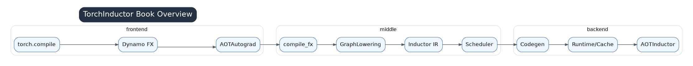

# TorchInductor Series Overview



This series is a source-reading guide for TorchInductor, based on the installed PyTorch 2.7.1 environment. The main Python source tree is `torch/_inductor/`; the C++ runtime is supplemented by `torch/csrc/inductor/` when AOTInductor and the C++ ABI are involved.

The chapters are organized by the real compilation path rather than by file name. Start from `torch.compile`, Dynamo FX graphs, and AOTAutograd; enter `compile_fx.py`; lower the post-grad FX graph through `GraphLowering`; build Inductor IR; let the scheduler analyze dependencies, fusion, ordering, and memory; then proceed to Triton, C++, templates, autotuning, caching, CUDA Graphs, and AOTInductor.

## Main Line Through Chapters 01-12

The first twelve chapters form one data flow:

```text
torch.compile / Dynamo
  -> FX GraphModule + example_inputs
  -> compile_fx.py
  -> AOTAutograd / pre-grad / joint / post-grad passes
  -> GraphLowering
  -> Inductor IR
  -> SchedulerNode / FusedSchedulerNode
  -> backend codegen
  -> runtime cache / CUDA Graph / AOTInductor
```

Key handoff objects are FX graphs, post-grad FX graphs, `TensorBox`, `ComputedBuffer`, `SchedulerNode`, generated kernel source, wrapper callables, cache artifacts, and AOTI shared libraries.

## Recommended Reading Order

1. `01_compile_fx_entry.md`: where Inductor sits as the `torch.compile` backend.
2. `02_fx_passes_and_aotautograd.md`: pre-grad, joint graph, post-grad passes, and AOTAutograd.
3. `03_graph_lowering_and_ir_overview.md`: how FX nodes become Inductor IR.
4. `04_lowering_mechanism.md`: how ATen ops become pointwise, reduction, view, extern, or template IR.
5. `05_shape_layout_alias_memory.md`: shape, layout, aliasing, mutation, and memory constraints.
6. `06_scheduler_fusion.md`: dependency analysis, fusion, ordering, and memory planning.
7. `07_codegen_overview.md`: how scheduled nodes enter device backends.
8. `08_triton_codegen.md`: generated Triton kernels.
9. `09_cpp_cpu_codegen.md`: CPU C++ and SIMD codegen.
10. `10_templates_and_autotune.md`: templates, GEMM, algorithm selection, and autotune.
11. `11_runtime_cache_cudagraph.md`: async compile, caches, and CUDA Graph.
12. `12_aotinductor_cxx_runtime.md`: export mode, C++ wrapper, and stable ABI.
13. `13_debug_and_performance.md`: graph breaks, recompiles, and slow kernel triage.
14. `14_examples_and_source_reading.md`: minimal examples and source-reading exercises.
15. `15_source_function_index.md`: source files and functions to revisit.

## Mental Model

Inductor is not a line-by-line PyTorch-to-Triton translator. It converts Dynamo/AOTAutograd FX graphs into a lazily materialized tensor IR. Many tensor values remain as expressions such as `TensorBox(StorageBox(Pointwise/Reduction/...))` until an output, mutation, fallback, template input, alias, or layout constraint forces materialization. The scheduler then decides which IR nodes can become one kernel based on read/write dependencies and backend capability.

For performance work, reason backward along the same chain: first check graph breaks and shape churn, then lowering/fallback, then premature realization and layout constraints, then scheduler fusion decisions, and only then the generated Triton/C++ kernel body.

## Three Questions To Keep Asking

1. Is this value still an expression, or has it become a buffer?
2. What are the read/write dependencies of this node?
3. Are the shape and layout stable enough for caching, autotuning, and CUDA Graph?
