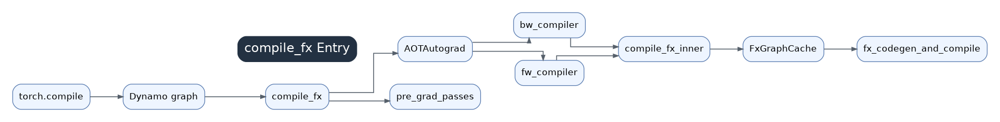

# 01 compile_fx Entry



`compile_fx.py` is the main Inductor entry point. Although it lives in `torch._inductor`, it orchestrates end-to-end compilation and delegates training graph handling to AOTAutograd. Single-graph compilation eventually flows through `compile_fx_inner()` and `_compile_fx_inner()`.

## Position In The Pipeline

This chapter receives the output of `torch.compile` and Dynamo: an FX `GraphModule`, `example_inputs`, compile configuration, guard context, and flags describing inference, training, export, and wrapper mode. The output is not a kernel yet; it is a set of compiler closures and single-graph compile requests that later enter `GraphLowering`.

Think of `compile_fx.py` as a dispatcher. It decides whether a graph takes the inference path, the AOTAutograd forward/backward path, the C++ wrapper path, the export path, a cache-hit path, or a recompilation path.

## What The Entry Does

`compile_fx()` normalizes config, handles C++ wrapper recursion, ensures tuple/list returns, deals with Dynamo export pytree codegen, runs pre-grad passes, and creates `fw_compiler_base()`, `bw_compiler()`, and `partition_fn()` for AOTAutograd.

`compile_fx_inner()` fills defaults such as `cudagraphs`, `static_input_idxs`, `is_backward`, `cpp_wrapper`, and `is_inference`, then enters `DebugContext()`. `_compile_fx_inner()` handles FX graph cache lookup and either loads a `CompiledFxGraph` or calls `fx_codegen_and_compile()`.

## AOTAutograd Relationship

Training graphs are not compiled as raw user forward code. AOTAutograd first builds and partitions a joint forward/backward graph, deciding what to save and what to recompute. Inductor receives already-partitioned single FX graphs and can focus on lowering, scheduling, and code generation.

## Key Data

- `example_inputs`: fake propagation, cache keys, autotune examples, and dynamic-shape hints.
- `static_input_idxs`: parameters, constants, and CUDA Graph static-input assumptions.
- `BoxedBool(cudagraphs)`: mutable flag used to disable CUDA Graph during compilation if needed.
- `graph_id`: ties forward/backward graphs inside one compile.
- `CompiledFxGraph`: runtime object containing wrapper callable, cache metadata, output strides, and related metadata.

## Source-Level Flow

```text
compile_fx()
  -> config patching / wrapper handling / tuple returns
  -> pre-grad passes
  -> AOTAutograd
     -> fw_compiler_base() / bw_compiler() / partition_fn()
  -> compile_fx_inner()
     -> cache key / cache load
     -> fx_codegen_and_compile()
        -> fake tensor propagation
        -> post-grad passes
        -> GraphLowering
        -> scheduler
        -> codegen
        -> PyCodeCache / C++ wrapper / AOTI
```

## Performance Meaning

If this layer is slow, distinguish Dynamo/AOTAutograd time from Inductor codegen or autotune time. Repeated compilation usually points to changing shape, stride, dtype, device, Python constants, or module state. Start with `TORCH_LOGS="graph_breaks,recompiles"`, `TORCH_COMPILE_DEBUG=1`, and `TORCH_TRACE` before inspecting Triton kernels.
