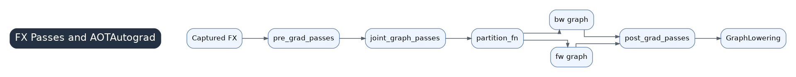

# 02 FX Passes And AOTAutograd



Inductor sees three major classes of graph transformation around the entry: pre-grad passes, joint graph passes, and post-grad passes. They live around `compile_fx.py`, `fx_passes/pre_grad.py`, `fx_passes/joint_graph.py`, and `fx_passes/post_grad.py` and strongly influence lowering, fusion, and kernel generation.

## Handoff From Chapter 01 To Chapter 03

`compile_fx()` creates `partition_fn()`, `fw_compiler_base()`, and `bw_compiler()`. AOTAutograd then turns high-level training semantics into forward and backward `GraphModule`s. The important handoff is:

```text
compile_fx.py
  -> pre-grad FX graph
  -> AOTAutograd joint graph
  -> partition_fn
  -> forward/backward GraphModule
  -> post-grad FX graph
  -> compile_fx_inner / GraphLowering
```

`GraphLowering` interprets the post-grad FX graph, not the original Python model.

## Pass Types

Pre-grad passes run before AOTAutograd while the graph still resembles user model structure. They are good places for high-level pattern cleanup and normalization.

Joint graph passes run on the combined forward/backward graph. They affect activation saving, rematerialization, and partition quality through min-cut rematerialization.

Post-grad passes run after forward/backward graphs have been split and decomposed. They are closest to lowering and directly determine whether Inductor sees familiar ATen patterns or unsupported/fallback operations.

## Why Passes Matter For Performance

The scheduler can only fuse the IR it sees. If the post-grad graph is fragmented by copies, views, unsupported ops, or graph breaks, later backend codegen cannot fully repair it. When common patterns are normalized into pointwise chains, reductions, matmul epilogues, attention, or conv patterns, Inductor can lower and fuse them effectively.

## Debugging Advice

When generated kernel count is too high or fallback appears, inspect the post-grad FX graph before reading Triton. Useful logs include:

```bash
TORCH_LOGS="post_grad_graphs,graph_breaks,recompiles" python your_script.py
```

If a high-level pattern is not recognized, model code can sometimes be rewritten to use standard PyTorch APIs, such as `torch.nn.functional.scaled_dot_product_attention`, so existing passes can match it.
