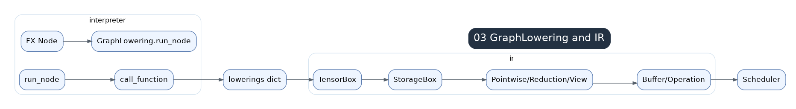
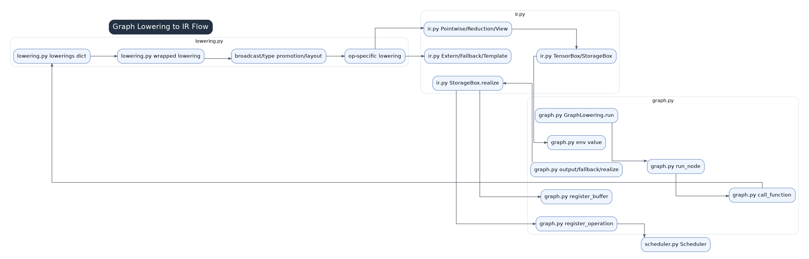

# 03 GraphLowering And IR Overview



`GraphLowering` in `graph.py` subclasses `torch.fx.Interpreter`. Its job is to interpret the post-grad FX `GraphModule` and convert each FX node into Inductor IR objects such as `TensorBox`, `IRNode`, `Buffer`, and operation lists. It does not directly emit code.

## Input From FX Passes

The graph has already gone through AOTAutograd, decomposition, fake tensor propagation, stride recording, and post-grad passes. It is closer to ATen execution semantics than to the original Python source.

```text
post-grad FX node
  -> GraphLowering.run_node()
  -> placeholder / get_attr / call_function / output
  -> TensorBox / IRNode / Buffer
  -> GraphLowering.operations
```

## Relationship Between graph.py, lowering.py, and ir.py



- `graph.py`: owns graph-wide state and drives FX interpretation.
- `lowering.py`: maps individual `aten` or `prims` ops into Inductor IR expressions.
- `ir.py`: defines the object model for those expressions and how they materialize into buffers.

The key bridge is `GraphLowering.call_function()`, which dispatches to `lowerings[target]`.

## Typical Call Chain

```text
GraphLowering.run()
  -> torch.fx.Interpreter.run()
  -> GraphLowering.run_node(fx_node)
  -> GraphLowering.call_function(target=aten.add.Tensor, args, kwargs)
  -> lowerings[target](*args, **kwargs)
  -> transform args / type promotion / broadcast
  -> make_pointwise(...)
  -> ir.Pointwise.create(...)
  -> TensorBox(StorageBox(Pointwise))
```

The result returned to the FX environment is not a `torch.Tensor`; it is a lazy Inductor value. It may stay fusible until an output, fallback, mutation, template input, or layout constraint forces realization.

## Realization Path

`StorageBox.realize()` wraps lazy `Pointwise`, `Reduction`, `Scan`, or `Sort` expressions into `ComputedBuffer`s and calls `V.graph.register_buffer()` and `V.graph.register_operation()`. This writes the IR object back into the current `GraphLowering` instance so the scheduler can see it.

## Why It Is Designed This Way

If every lowering immediately created a buffer, pointwise chains would become many kernels. Lazy IR allows expressions to be composed and fused. `graph.py` decides when lowering is invoked and when outputs must be finalized; `lowering.py` decides what kind of IR an op creates; `ir.py` decides how that IR stays lazy or becomes a buffer.

## Things To Watch

- `graph_inputs`, `graph_outputs`, constants, mutations, aliases, and layout optimization state.
- Whether a value is still a `TensorBox` expression or has become a `Buffer`.
- `call_function()` dispatch: registered lowering, fallback, or special-case handling.
- Output and mutation handling, because they often force realization.
