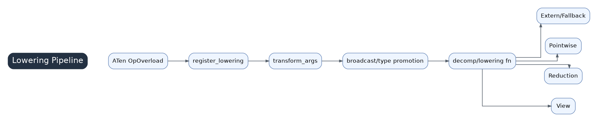

# 04 Lowering Mechanism



Lowering receives one operation request from `GraphLowering.call_function()` and translates it into Inductor IR. Registered lowerings decide whether an ATen operation becomes a `Pointwise`, `Reduction`, `View`, `ExternKernel`, template choice, or fallback.

## Where lowering.py Fits

```text
FX call_function node
  -> GraphLowering.call_function()
  -> lowerings[target]
  -> lowering wrapper
  -> IR object in ir.py
```

`graph.py` controls graph interpretation, `lowering.py` is the op-level translation table, and `ir.py` defines the target representation.

## The lowerings Dictionary

`register_lowering()` installs functions into the `lowerings` dictionary. The wrapper around each lowering normally handles argument transformation, type promotion, broadcasting, layout constraints, decompositions, and fallback conditions before calling the op-specific lowering body.

## Common Lowering Shapes

- Pointwise: elementwise expressions that can remain lazy and fuse with neighbors.
- Reduction: reductions that define reduction axes, accumulation dtype, and output layout.
- View: metadata-only transformations that usually produce no kernel but affect later layout and indexing.
- Extern/fallback: calls into external libraries or eager fallbacks when Inductor cannot express an op.
- Template-related paths: matmul, convolution, attention, and other structured high-performance cases.

## Why Views Matter

Views rarely generate kernels, but they change size, stride, storage offset, and index formulas. A cheap view can make a later kernel more complex, constrain layout, or prevent fusion.

## Fallback Meaning

Fallback is not always a compiler failure; it is an engineering escape hatch. But for performance work, fallback is a signal to inspect whether the op could be decomposed, rewritten in model code, or mapped to a supported library/template path.

## Reading Order For A New Op

1. Find whether the target is registered in `lowering.py` or decomposed earlier.
2. Inspect wrapper behavior: promotion, broadcasting, layout constraints, and fallback.
3. Identify the IR class created.
4. Check whether the value remains lazy or is immediately realized.
5. Follow how the scheduler later handles that IR.

## Performance Implications

Poor generated kernels often start here. If an op lowers to fallback, realizes too early, or creates a layout-constrained buffer, scheduler and Triton codegen have less room to optimize.
