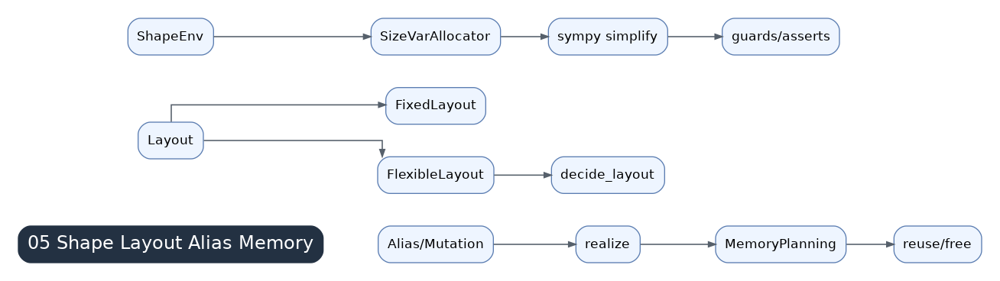

# 05 Shape, Layout, Alias, And Memory

Inductor IR carries shape, layout, alias, mutation, and memory constraints. These constraints connect lazy lowering results to scheduler decisions and determine whether fusion, memory reuse, and CUDA Graph capture are legal.

## From Expressions To Constraints

A lowered value may be lazy, but it still has symbolic sizes, layout choices, aliasing behavior, and possible mutation effects. The scheduler cannot fuse or reorder nodes safely unless these properties are understood.

## Dynamic Shape And SizeVarAllocator

`SizeVarAllocator` tracks symbolic sizes, simplifies expressions, emits guards or runtime assertions, and connects symbolic dimensions to generated code. Dynamic shape performance depends on whether dimensions stabilize, become bucketed, or remain fully symbolic.

## Layout

Layouts may be fixed or flexible. Flexible layouts allow Inductor to choose a layout that improves fusion and indexing. Fixed layouts arise from outputs, external calls, views, mutations, template inputs, or explicit contiguous/stride requirements.

## Views And Strides

Views often avoid kernels, but their stride semantics propagate into later indexing. A view that looks free can still make later kernels expensive.

## Alias And Mutation

Aliases and mutations constrain scheduling. If two buffers may share storage or a node mutates an input, dependencies become stricter and memory planning must be conservative.

## Memory Planning

Memory planning decides buffer lifetimes, reuse, and workspace needs after scheduling constraints are known. It is conservative where aliasing, mutation, external calls, or outputs make reuse unsafe.

## Optimization Clues

- Shape churn causes recompiles and weak cache reuse.
- Layout freezes can prevent fusion or force copies.
- Alias/mutation can block reordering.
- Memory planning issues show up as temporary materialization and peak-memory spikes.
