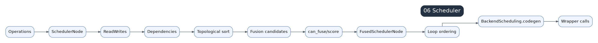

# 06 Scheduler, Ordering, And Fusion



The scheduler receives IR operations and buffers from `GraphLowering` and turns them into `SchedulerNode` or `FusedSchedulerNode` objects. It analyzes dependencies, decides fusion, orders loops, and prepares work for backend codegen.

## Handoff Into Scheduler

```text
GraphLowering.operations / buffers
  -> Scheduler
  -> SchedulerNode / FusedSchedulerNode
  -> backend scheduling
  -> codegen
```

Shapes, layouts, aliases, mutations, and read/write sets become hard constraints. Fusion is only legal when dependencies and backend capabilities allow it.

## SchedulerNode

A `SchedulerNode` wraps an IR buffer or operation with read/write dependencies, estimated cost, device, layout, loop ranges, mutation information, and codegen metadata. A fused node is not just concatenation; it is a new scheduling unit with combined dependencies and loop semantics.

## Dependency Analysis

`read_writes` is one of the most important scheduler inputs. It decides whether nodes can move, fuse, or must remain ordered. Mutation and aliasing add additional ordering constraints.

## Fusion Strategy

Fusion normally checks legality, profitability, and backend support. Too little fusion creates launch overhead and intermediate memory traffic. Too much fusion can create register pressure, poor memory access, complicated indexing, or slow reductions.

## Loop Order And Memory

Loop ordering influences coalescing and vectorization. Memory planning uses final order and liveness to reuse buffers where safe. Output buffers, aliases, mutations, and external calls limit reuse.

## Performance Reading

When many small kernels appear, inspect fusion boundaries and dependency constraints. When one giant kernel is slow, inspect over-fusion, register pressure, indexing, masks, and memory access. Always connect profiler evidence back to scheduler decisions before editing generated Triton code.
