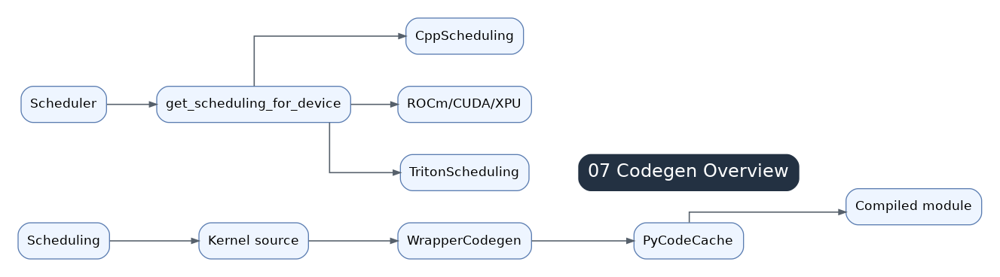

# 07 Codegen Overview

Codegen receives scheduled nodes and emits backend-specific kernel code plus wrapper code. The wrapper owns runtime orchestration; kernels own device computation.

## From Scheduler To Backend

Scheduled and fused nodes are handed to backend-specific scheduling/codegen paths. GPU pointwise and reductions often go to Triton; CPU loops go to C++; structured operations such as GEMM or convolution may go through templates and autotune choices.

## Backend Registration

Inductor registers backend scheduling implementations by device type. This lets the same scheduler handoff feed Triton, C++, or specialized template paths depending on device and operation class.

## Wrapper Role

The wrapper checks inputs, manages buffers, launches kernels, handles constants, calls external kernels, records CUDA Graph compatibility, and returns outputs. Python wrappers are used for normal JIT execution; C++ wrappers appear in AOT and deployment-oriented paths.

## Kernel vs Wrapper

A generated kernel should be read for computation, indexing, memory access, and reductions. A wrapper should be read for launch order, buffer lifetime, input checks, workspace, stream behavior, and cache/runtime interactions.

## Reading Generated Code

Start with wrapper launch order and buffer names. Then map each kernel back to scheduler nodes and generated source. Reading `codegen/triton.py` first can be misleading if you do not know why a kernel exists.
