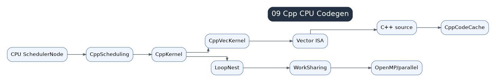

# 09 C++ / CPU Codegen

CPU codegen emits C++ loops, vectorized kernels, and sometimes template-based code. It is separate from Triton because CPU performance depends on loop nests, vectorization, threading, cache locality, and scalar fallback behavior.

## CPU Path

`CppScheduling` receives scheduler nodes and emits loop nests. `CppVecKernel` handles vectorized expressions where possible. Work-sharing and parallel loops manage threading.

## Vectorization

Vectorization depends on dtype support, alignment, contiguous or simple stride patterns, masks, and reduction structure. When vectorization fails, generated code may fall back to scalar loops and become slow.

## WorkSharing And Parallelism

CPU codegen must decide what loops are parallel, how work is split, and how reductions combine partial results. Prefix/suffix handling and masks are common in reductions.

## Difference From GPU

GPU codegen optimizes launch configuration and memory coalescing; CPU codegen optimizes loop order, vector lanes, cache behavior, and OpenMP-style work sharing. The same IR can require very different backend decisions.
