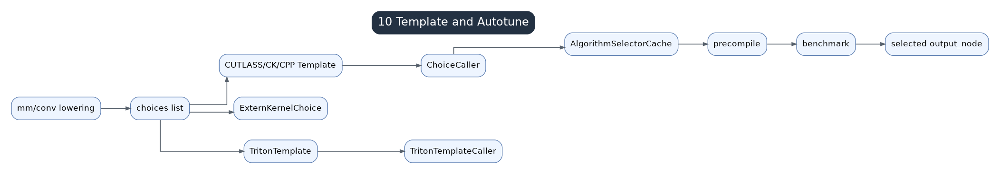

# 10 Templates And Autotune

Templates cover structured high-performance operations such as GEMM, convolution, and attention. They span lowering, scheduling, codegen, and runtime autotuning.

## ChoiceCaller Mental Model

A `ChoiceCaller` is an executable candidate. Different candidates can represent Triton templates, external kernels, or other implementations. Autotune selects among them using representative inputs and cached benchmark results.

## Main Components

- `TritonTemplate`: generates specialized Triton source for a structured operation.
- `ExternKernelChoice`: wraps external or library implementations.
- `AlgorithmSelectorCache`: benchmarks and caches the best candidate.
- `MultiTemplate`: keeps several template options available until selection.

## GEMM Example

Matmul lowering often creates multiple choices rather than a single generic lowering. These choices may include library calls, Triton templates, or specialized variants. `max-autotune` can be slow because it expands and benchmarks more candidates, but the selected steady-state kernel may be faster.

## Autotune Is Not Magic

Autotune measures candidates under assumed shapes, layouts, dtypes, and device state. If inputs churn, cache keys change, or benchmark examples are not representative, autotune cost can dominate or the selected algorithm can be poor.
