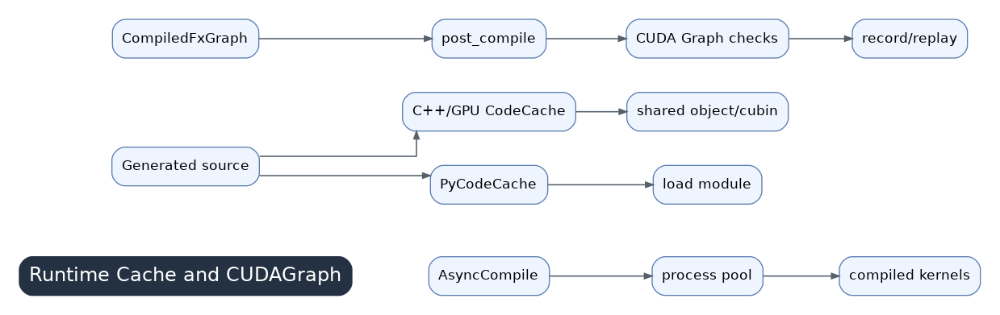

# 11 Runtime, Cache, And CUDA Graph

After codegen, Inductor must compile generated source, load callable modules, cache results, and optionally use CUDA Graphs. Runtime behavior can dominate perceived performance even if generated kernels are good.

## Cache Layers

- FX graph cache: keyed by graph semantics, input metadata, and relevant config.
- Code cache: turns generated source into Python modules, compiled binaries, or shared objects.
- Autotune cache: stores selected algorithm choices.
- Remote cache may be involved depending on configuration.

## AsyncCompile

Compilation of generated kernels can happen asynchronously. This hides some compile wall time but can also make profiling confusing. Separate cold compile, warmup, and steady-state measurements.

## CUDA Graph

CUDA Graph capture reduces Python/dispatcher overhead but requires stable shapes, memory addresses, streams, and no incompatible operations. Inductor records skip reasons when capture is unsafe.

## Common Runtime Problems

Repeated recompilation, cache misses, long autotune, failed CUDA Graph capture, unstable shapes/strides, and changing Python constants all show up here. Read `TORCH_LOGS="recompiles,perf_hints"` and Inductor debug artifacts before blaming a single generated kernel.
