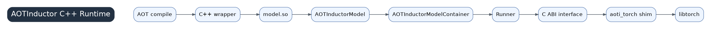

# 12 AOTInductor And C++ Runtime

AOTInductor packages Inductor compilation results for deployment. Instead of returning a Python wrapper callable, it emits C++ wrapper/runtime artifacts and a shared library interface.

## How AOTI Receives Previous Results

The same graph lowering, scheduling, and backend codegen concepts apply, but codegen targets a C++ wrapper and stable runtime boundary. Constants, weights, input/output ABI, and container ownership become central concerns.

## C++ Wrapper And Runtime Model

The generated wrapper manages input checks, buffer allocation, constants, kernel launches, and output construction. The runtime container owns model state and exposes a stable C ABI or runner interface so non-Python callers can execute the model.

## Why A C Shim Exists

A stable C ABI isolates callers from C++ name mangling, compiler ABI differences, and internal runtime details. It also makes the compiled model easier to load from other languages or serving systems.

## Deployment Concerns

AOTI performance is not just kernel quality. Check constant handling, memory ownership, device placement, stream behavior, ABI compatibility, version constraints, and whether exported shapes/layouts match serving workloads.
