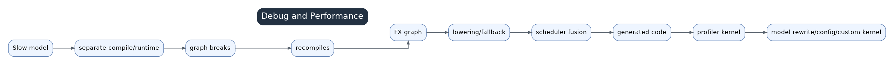

# 13 Debug And Performance Optimization



Inductor performance debugging should follow evidence from front to back, not jump directly into custom kernels.

## Basic Logs

Useful starting points:

```bash
TORCH_LOGS="graph_breaks,recompiles,dynamic" python your_script.py
TORCH_COMPILE_DEBUG=1 python your_script.py
TORCH_TRACE=/tmp/torch_trace python your_script.py
```

For Inductor internals, add logs such as `output_code`, `kernel_code`, `schedule`, `perf_hints`, and `fusion` when needed.

## Common Slow Causes

- Graph breaks split the hot path.
- Recompiles from changing shape, stride, dtype, device, Python constants, or module state.
- Fallbacks or external calls in hot regions.
- Too many tiny kernels from weak fusion.
- Over-fused kernels with register pressure or complex indexing.
- Poor layout choices and hidden copies.
- Compile/autotune time dominating steady-state.
- Data pipeline or synchronization starving the device.

## Preferred Optimization Order

1. Fix graph breaks and recompiles.
2. Stabilize shape/layout and remove host sync.
3. Rewrite model code toward standard PyTorch ops.
4. Inspect post-grad FX and lowerings.
5. Inspect scheduler fusion decisions.
6. Inspect generated Triton/C++ source.
7. Consider pass-inserted custom kernels only with stable E2E evidence.

## Mapping Profiler Kernels Back To Source

Use generated code artifacts, wrapper launch order, kernel names, and `TORCH_COMPILE_DEBUG=1` output. Map a profiler hotspot to wrapper call, generated source, scheduler node, IR buffer, and finally the FX/model pattern.
