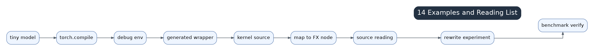

# 14 Practical Examples And Source Reading Checklist



Use small examples to connect generated code back to source. A useful example is:

```python
y = torch.relu(x @ w + b).sum(-1)
compiled = torch.compile(fn)
compiled(x, w, b)
```

This can exercise Dynamo capture, AOTAutograd boundaries if training is enabled, matmul/template paths, pointwise epilogues, reduction, scheduler fusion, generated code, and runtime cache.

## Source Reading Checklist

Start from:

- `compile_fx.py`: entry, AOTAutograd callbacks, cache lookup.
- `fx_passes/*`: pre-grad, joint, and post-grad graph rewrites.
- `graph.py`: `GraphLowering` and global compile state.
- `lowering.py`: registered ATen lowerings.
- `ir.py`: `TensorBox`, `StorageBox`, `ComputedBuffer`, `Pointwise`, `Reduction`, `View`, `ExternKernel`.
- `scheduler.py`: dependency analysis, fusion, ordering, memory.
- `codegen/triton.py`: generated GPU kernels.
- `codegen/cpp.py`: generated CPU loops.
- `select_algorithm.py` and `kernel/mm.py`: templates and autotune.
- runtime/codecache files: caching, async compile, CUDA Graph, and AOTI.

## Exercise Flow

1. Run a tiny compiled function with `TORCH_COMPILE_DEBUG=1`.
2. Inspect FX/post-grad graph artifacts.
3. Locate lowering for the main ops.
4. Follow realized buffers into scheduler nodes.
5. Read wrapper launch order.
6. Inspect generated Triton/C++ code.
7. Change shape/layout and observe recompilation, cache keys, and generated code differences.

The goal is to build performance intuition, not memorize file names.
