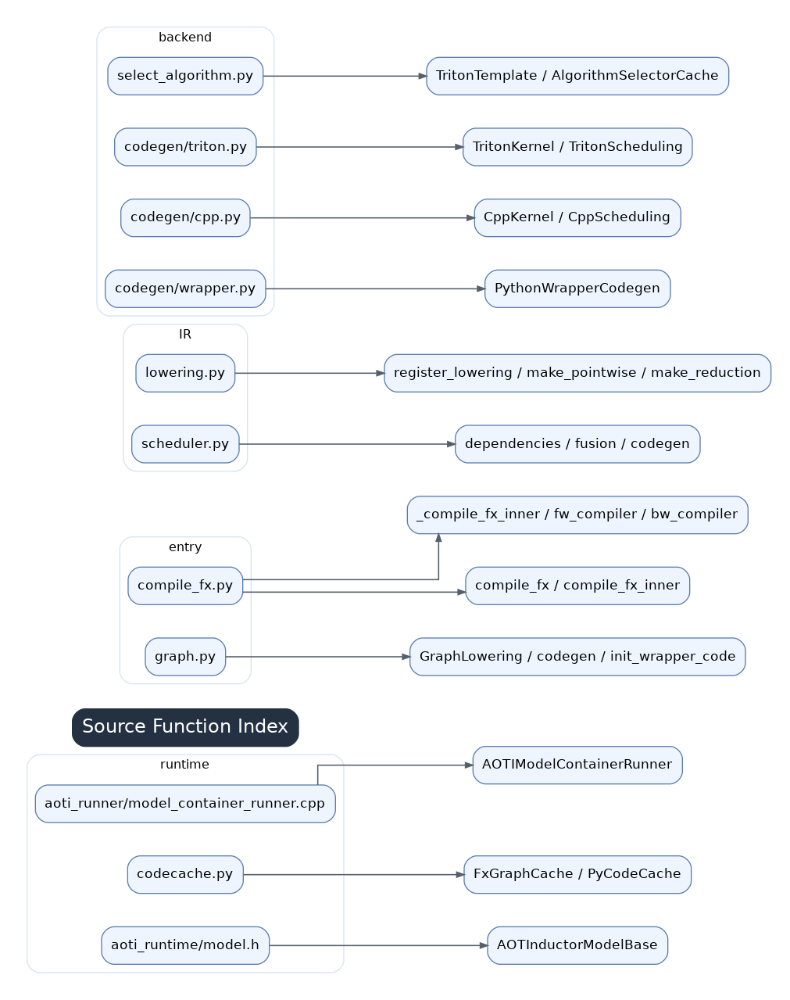

# 15 Source Function Index

Use this index to jump from a performance symptom to the source layer that likely owns it.

## Entry Layer

- `compile_fx.py`: `compile_fx`, `compile_fx_inner`, `_compile_fx_inner`, `fx_codegen_and_compile`.
- AOTAutograd compiler closures: `fw_compiler_base`, `bw_compiler`, `partition_fn`.
- Cache-related objects: `CompiledFxGraph`, `FxGraphCache`.

## IR And Lowering

- `graph.py`: `GraphLowering`, `run_node`, `call_function`, `register_buffer`, `register_operation`, output handling.
- `lowering.py`: `register_lowering`, `lowerings`, fallback helpers, layout constraints.
- `ir.py`: `TensorBox`, `StorageBox`, `Pointwise`, `Reduction`, `ComputedBuffer`, `View`, `ExternKernel`, realization methods.

## Scheduling And Backend

- `scheduler.py`: `Scheduler`, `SchedulerNode`, `FusedSchedulerNode`, dependency refresh, fusion checks, loop ordering, memory planning.
- backend scheduling: Triton scheduling and C++ scheduling paths.
- wrapper codegen: Python wrapper and C++ wrapper emitters.

## Templates And Autotune

- `select_algorithm.py`: `ChoiceCaller`, `AlgorithmSelectorCache`, benchmark and cache logic.
- template modules: Triton templates, GEMM/conv/attention-specific choices.
- `kernel/mm.py`: matmul lowering and candidate generation.

## Runtime And AOT

- code cache modules: Python code cache, C++ code cache, async compile.
- CUDA Graph utilities and skip reasons.
- AOTInductor codegen and C++ runtime files under `torch/csrc/inductor/`.

## How To Use This Index

If the symptom is graph breaks or recompilation, start at Dynamo logs and `compile_fx.py`. If it is fallback, start at post-grad FX and `lowering.py`. If it is too many kernels, start at scheduler fusion. If it is one slow generated kernel, map it through wrapper -> generated source -> scheduler node -> IR -> FX pattern.
